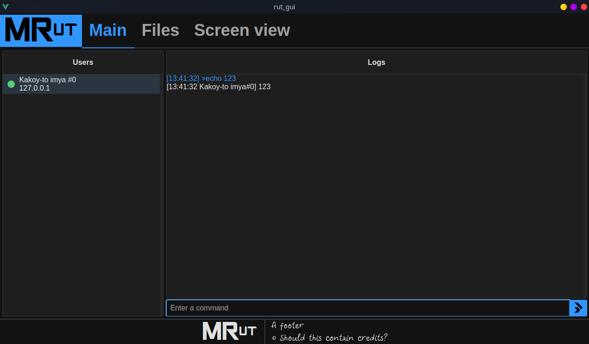
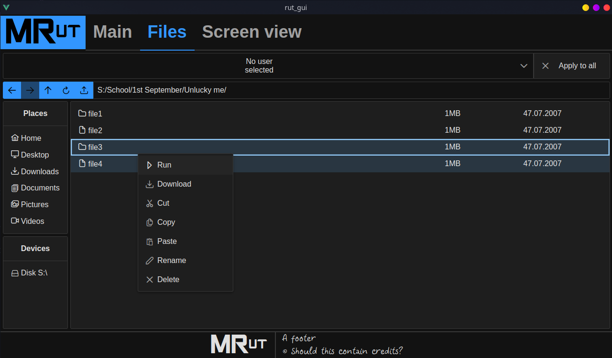
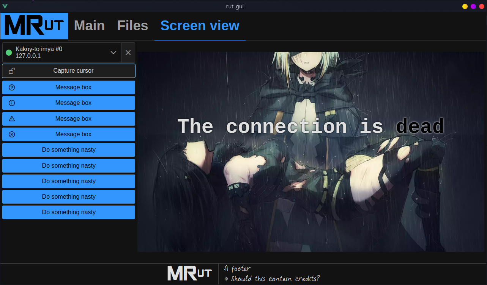

# Multi-target Remote udministration tool, AKA MRut
Frontend for my app. My practice with **Vue.js**, **Vuex** and **PrimeVUE**. Mb i'll improve [**FWGUI**](https://github.com/Foresteam/FWGUI), just by the way.

## How to run
Install **Node.js (i use 16.15.1)**, **npm**.
```sh
git clone https://github.com/Foresteam/MRut-Frontend.git
cd MRut-Frontend
npm i --save-dev
npm run serve
```
Open the shown link in your browser (should end with port 8080).

## The UI


